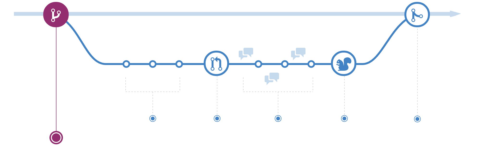

# MAPTIME Introduction to Git
An Introduction to Git

Date: Tuesday, January 24, 2017 - 18:45

#HSLIDE


#HSLIDE

## The plan:

* Give a brief overview on what versioning is
* Set up Git on your machine
* Create a Repository
* Tracking Changes; or `add`, `commit`, `log`
* Recover old Changes
* Collaborating
* Conflicts
* The Leaflet Map Exercise

#HSLIDE

# Setup

### Step 1: Get Wifi
To Access the Ryerson Wifi, you'll need the following: 
_Note to self: Get Ryerson public wifi info on monday in advance_
_ ensure wifi is on the presentation _

#HSLIDE

# Setup

### Step 2: Get Git and a Github Account!

(For all common platforms)
* GIT: https://git-scm.com/downloads

* Github: https://github.com

#HSLIDE

# Theory

#HSLIDE

### Setup - Continued

1. Open the terminal
2. Enter the following with your own information

```
git config --global user.name "Brian Bancroft"
git config --global user.email hello@brianbancroft.ca
```
#HSLIDE

## Initializing a Repos

#### To initialize a repo:
1. Navagate to the programming directory:
  * For PC Users: Go to `C:\` directory, then `mkdir git-intro`
  * For Mac/Linux: `cd ~/`, then `mkdir git-intro`
 2. Initialize a repo by typing in `git init`. 

#HSLIDE

### Git status
`git status` shows the status of your repo including changes that are staged, or unstaged. 

#HSLIDE


#HSLIDE

## Commiting to a Changes
Once you've made a file with a few lines:

1. *Stage it*: `git add <filename>` or `git add .`, which adds one or more files. 
2. *Commit it*: `git commit -m <message here>`

#HSLIDE

### Where do the old versions go?

#HSLIDE

### Undoing your last set of Changes
If you've _added_ files that you want to undo, the command you seek is `git reset`. To reset a single file, it's `git reset HEAD <filename>`.


#HSLIDE

There are also circumstances where you want to revert your saving to the last commit. There are two commands which you should only use if you really need to. They are as follows:

1. `git reset --hard HEAD` for all files
2. `git checkout -- <filename>` if you only wish to revert a single file

*BEWARE...*
#HSLIDE

## Logs and Diffs

* If you wish to track the commits in a branch: `git log`

 * `git diff` shows the difference between what you've saved and the last commit. It can also show differences between other things, too!

#HSLIDE

### Branches



#HSLIDE

### Branch Commands

* View Branches: `git branch`
* Create new Branch: `git checkout -b new-branch`
* Switch from `new-branch` to `master`: `git checkout master`
* Switch back to new branch: `git checkout new-branch`

#HSLIDE

### Merge

* Go to the destination branch
* Merge in the source branch: `git merge new-branch`

#HSLIDE

#Conflicts!

#HSLIDE


### Fork and Clone a repo

Go to `https://github.com/brianbancroft/leaflet-git-exercise`

For this part, we want to show individuals 

### Best Collaboration: The Pull Request

Sometimes when collaborating, it's entirely possible to run into conflicts with your source material. 

# Leaflet Exercise
So this is the last portion. Because Maptime is about the intersection of mapping and the internet, it wouldn't feel right to finish the night without putting our hands on a map 

`git clone <insert repo for maptime leaflet example here>`

# Conclusion

Thanks for bearing with me for the last 1:20. What I've scratched is the basics of Git, and Github which are used widely by open source developers in both geospatial and non geospatial application. As you improve with these tools, as well as the command line, you'll find that there's a lot of ground to learn to use it in your day-to-day workflow. 


#HSLIDE
### Source Material: 
* http://swcarpentry.github.io/git-novice/
* http://try.github.io

Copyright © Software Carpentry 
